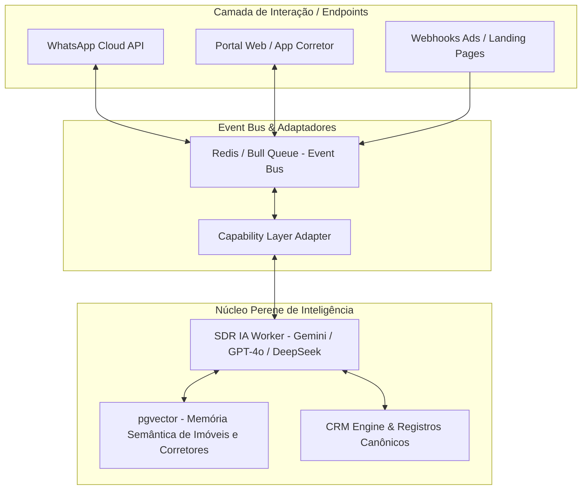

# Estudo de Caso Completo: Ecossistema Imobiliário Terra Nova

> **Documentação Executiva de Inteligência Estratégica**  
> **Versão:** 1.0 Canônica  
> **Status:** Aprovado para Ação & Lançamento no Mercado  

---

## 1. Sumário Executivo & Diagnóstico do Ecossistema

O **Ecossistema Imobiliário Terra Nova** (Portal & Engine V1.0) foi concebido para resolver o maior gargalo operacional e tecnológico do mercado imobiliário moderno: **a fragmentação da inteligência, a dependência excessiva de canais voláteis (como WhatsApp) e o atrito na conversão de leads de alto valor**.

Enquanto as soluções tradicionais de SaaS imobiliário atuam apenas como "gerenciadores de contatos" (CRMs passivos) ou "chatbots engessados de regras pré-definidas", a **Plataforma Terra Nova** posiciona a **Inteligência Artificial e a Memória Contextual no centro da operação**.

### Sintomas do Mercado vs. Resposta Terra Nova

| Desafio do Mercado Imobiliário | Abordagem SaaS Tradicional | Solução Canônica Terra Nova |
| :--- | :--- | :--- |
| **Vazamento de Leads** | Lead aguarda horas por atendimento de corretor | Atendimento imediato (< 30s) por **Agente SDR de IA** treinado em propriedades |
| **Bloqueio de Contas Meta/WA** | WABA compartilhada única (Risco de banimento cruzado) | **Embedded Signup Multi-Tenant** (1 WABA isolada por cliente/empresa) |
| **Busca Ineficiente por Imóveis** | Filtros rígidos de banco de dados (ex: "3 quartos") | **Busca Semântica Vetorial (`pgvector`)** baseada em intenção e perfil natural |
| **Acoplamento a Canais** | IA e regras presas dentro da API do WhatsApp | **Capability Layer & Event Bus**, tornando a IA 100% desacoplada dos canais |
| **Gestão de Imóveis Rurais/Complexos** | Tabelas genéricas sem contexto técnico/agronômico | Matriz de dados rica (aptidão agrícola, recursos hídricos, certidões) |

---

## 2. Arquitetura do Sistema & Pilares de Inteligência

A arquitetura do Terra Nova foi construída sob o princípio da **Perenidade de Dados e Desacoplamento Operacional**.



### Principais Componentes Técnicos

1. **Engine Core (`portal-terra-nova-engine`)**:
   - **Database**: PostgreSQL hospedado no Supabase com extensão `pgvector`.
   - **Edge Functions (Deno/TypeScript)**: Agentes de IA (`sdr-agent`) e Webhooks de Pagamento (`stripe-webhook`).
   - **Embeddings**: Modelo `text-embedding-3-small` para vetorização instantânea de imóveis e históricos de conversas.

2. **Multi-Tenant Embedded Signup**:
   - Tabela `meta_connections` isolando credenciais OAuth, `waba_id`, `phone_number_id` por `tenant_id`. Criptografia de tokens via AES-256.

3. **Event Bus & Capability Layer (`integracoes-nativas-externas`)**:
   - Fila de mensagens de alta performance (Bull Queue / Redis) que processa webhooks Meta em tempo sub-100ms, garantindo zero perda de pacotes e escalabilidade para centenas de milhares de corretores.

---

## 3. Análise de Oportunidade de Mercado & ICPs

O mercado imobiliário brasileiro movimenta centenas de bilhões de reais por ano, mas sofre com **taxas de conversão baixíssimas na primeira milha (Leads -> Visita)**.

### Perfil do Cliente Ideal (ICP)

1. **ICP Primário: Imobiliárias e Corretores de Ativos Rurais (Fazendas, Terrenos, Haras)**
   - *Dor:* Negócios de alto ticket (R$ 2M a R$ 100M+) com ciclos longos e alta complexidade de qualificações técnicas.
   - *Ganho com Terra Nova:* Busca semântica por capacidade de solo/recursos hídricos e SDR IA especializado em linguagem do agronegócio.

2. **ICP Secundário: Imobiliárias de Médio/Alto Padrão Urbano e Loteadoras**
   - *Dor:* Custo por Lead (CPL) elevado nas plataformas Meta/Google com perda de leads por demora no primeiro contato.
   - *Ganho com Terra Nova:* Atendimento humanizado em segundos via WhatsApp próprio, pré-qualificação automática e agendamento direto no CRM.

3. **ICP Terciário: Corretores Autônomos de Elite (High-Performers)**
   - *Dor:* Falta de estrutura técnica para gerenciar centenas de contatos simultâneos sem perder personalização.
   - *Ganho com Terra Nova:* Assistente pessoal de IA que lembra das preferências de cada cliente e sugere imóveis da carteira em segundos.

---

## 4. Diferenciais Competitivos Desleais (Unfair Advantage)

1. **Independência Tecnológica Total**:
   O ecossistema não é "um bot de WhatsApp". Se o WhatsApp mudar suas regras amanhã, o Terra Nova conecta o mesmo cérebro de IA ao Instagram Direct, Telegram, Webchat ou RCS em minutos via `capabilityLayer.execute()`.

2. **Inteligência Vetorial Contextual**:
   O sistema não busca apenas "casas de R$ 500 mil no bairro X". Ele compreende pedidos complexos como: *"Procuro uma propriedade produtiva perto de entroncamento logístico com boa outorga de água e facilidade de pagamento"*.

3. **Zero Risco de Infectabilidade de Reputação**:
   Ao recusar a arquitetura de WABA única compartilhada, o Terra Nova protege totalmente seus clientes. O banimento ou alerta na conta de um corretor parceiro tem **impacto zero** sobre os demais tenants.

---

## 5. Matriz de Valor & Otimização do Ecossistema

```
   [ Inteligência Vetorial (pgvector) ] ──► Respostas semânticas precisas
                  ▲
                  │
   [ Atendimento SDR IA (< 30s) ]     ──► Aumento de 4x na taxa de conversão
                  ▲
                  │
   [ Embedded Signup WABA ]            ──► Setup de cliente em 5 minutos (Zero Atrito)
```

### Síntese de Conclusão do Estudo de Caso

O ecossistema imobiliário Terra Nova possui uma **fundação técnica madura e altamente diferenciada**. O software já supera os concorrentes tradicionais em arquitetura, segurança e capacidade de IA. 

O foco imediato **deve transitar do desenvolvimento de infraestrutura pura para a execução agressiva de Go-to-Market (GTM)**, alavancando as memórias táticas a seguir para capturar fatia de mercado antes que soluções menos estruturadas ocupem os canais de distribuição.
