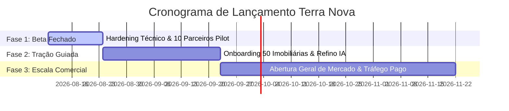

# Memória Estratégica: Roadmap de Lançamento & Otimização Contínua

> **Plano Operacional de Ação e Go-Live Imediato**  
> **Ecossistema Imobiliário Terra Nova**  
> **Objetivo:** Estabelecer o cronograma definitivo de lançamento, checklist de prontidão e loop de feedback para otimização em produção.

---

## 1. Checklist Definitivo de Prontidão para Go-Live (Checklist de Produção)

Antes de abrir o software para os primeiros clientes comerciais, a checklist abaixo deve estar 100% checada:

### Infraestrutura & Banco de Dados
- [x] Schema inicial aplicado no Supabase (`20260207_init_schema.sql`).
- [x] Extensão `pgvector` habilitada com índice HNSW para busca vetorial em sub-50ms.
- [x] Tabela `meta_connections` configurada com suporte a múltiplos `tenant_id`.

### Inteligência Artificial & Agentes
- [x] Supabase Edge Function `sdr-agent` operacional com suporte a GPT-4o / DeepSeek / Gemini.
- [x] Prompts canônicos de qualificação imobiliária ajustados (identificação de orçamento, urgência, tipo de imóvel).
- [x] Embeddings de propriedades gerados via `text-embedding-3-small`.

### Pagamentos & Onboarding
- [x] Supabase Edge Function `stripe-webhook` ativa tratando `payment_intent.succeeded`.
- [x] Fluxo de Embedded Signup Meta testado em ambiente de desenvolvimento.

---

## 2. Cronograma de Lançamento em 3 Fases (The Go-to-Market Sprints)



### Fase 1: Beta Fechado & Hardening (14 Dias)
* **Objetivo:** Validar a operação em condições reais com 10 corretores parceiros selecionados (5 do segmento rural / 5 do urbano alto padrão).
* **Entregáveis:**
  - Onboarding presencial/remoto assistido.
  - Monitoramento diário de logs de conversa do SDR Agent.
  - Ajuste fino dos prompts de qualificação baseados em conversas reais.

### Fase 2: Tração Guiada (30 Dias)
* **Objetivo:** Expandir para 50 imobiliárias ativas e validar a retenção (Churn = 0).
* **Entregáveis:**
  - Liberação do portal self-service de onboarding (Embedded Signup Meta).
  - Lançamento do dashboard visual de métricas de leads para donos de imobiliárias.
  - Ativação de campanhas Outbound para ICPs rurais e urbanos.

### Fase 3: Escala Comercial Aberta (60+ Dias)
* **Objetivo:** Ganhar escala nacional e posicionar o Terra Nova como referência no setor imobiliário.
* **Entregáveis:**
  - Campanhas de mídia paga em grande escala (Meta Ads + Google Ads).
  - Parcerias com associações e redes de franquias imobiliárias.
  - Expansão da *Capability Layer* para suporte nativo a Instagram Direct e Telegram.

---

## 3. Loop de Otimização Contínua Baseado em Telemetria Real

O desenvolvimento do software não para no lançamento; ele se otimiza continuamente com base nos dados gerados pelos leads.

```
┌─────────────────────────┐     ┌─────────────────────────┐     ┌─────────────────────────┐
│ 1. Telemetria em Tempo  │ ──► │ 2. Análise de Transcrições│ ──► │ 3. Ajuste Fino Semântico│
│ Real (Latência / Opt-in)│     │ (Gargalos de Qualificação)│   │ (Prompts & Embeddings)  │
└─────────────────────────┘     └─────────────────────────┘     └─────────────────────────┘
                                                                             │
                                                                             ▼
                                                                ┌─────────────────────────┐
                                                                │ 4. Re-deploy Automático │
                                                                │ de Agentes de IA        │
                                                                └─────────────────────────┘
```

### Métricas Primárias de Acompanhamento (OKRs / KPIs):

1. **Tempo de Primeira Resposta (FRT - First Response Time)**:
   - *Meta:* < 30 segundos em 99% das interações.

2. **Taxa de Qualificação Efetiva (Qualification Rate)**:
   - *Meta:* > 40% dos leads frios convertidos em contatos qualificados com agendamento/solicitação de proposta.

3. **Precisão da Busca Vetorial (Vector Match Accuracy)**:
   - *Meta:* > 90% de satisfação do lead com os imóveis sugeridos pelo SDR Agent no primeiro envio.

4. **Taxa de Sucesso do Onboarding (Time-to-Value)**:
   - *Meta:* Conexão do WhatsApp via Embedded Signup finalizada em menos de 5 minutos em 95% dos novos cadastros.

---

## 4. Próximos Passos Executivos Imediatos

1. **Executar a Fase 1 (Beta Fechado)** com os primeiros 10 parceiros estratégicos.
2. **Utilizar os 4 documentos de memória gerados (`docs/memories/`)** como a base de conhecimento executiva e guia técnico permanente da equipe e das IAs.
3. **Iniciar os testes de onboarding self-service com o Embedded Signup da Meta**.
